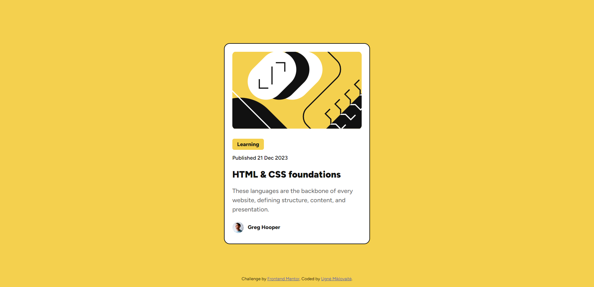

# Blog Preview Card Project

This is a simple and responsive blog preview card built using HTML and CSS. The design follows a minimalistic style and ensures readability across different screen sizes. This project was created as part of a Frontend Mentor challenge to practice layout skills and responsive design.

## Features:
- Responsive design with media queries
- Clean and modern look
- Optimized for both desktop and mobile views

## Screenshots:

### Desktop View:

### Mobile View:

Feel free to explore the project and suggest any improvements